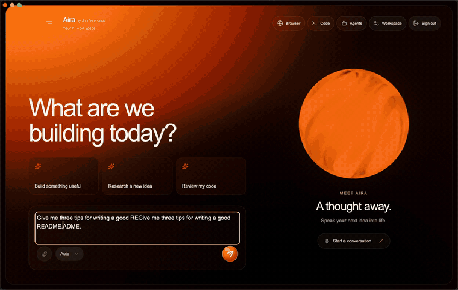
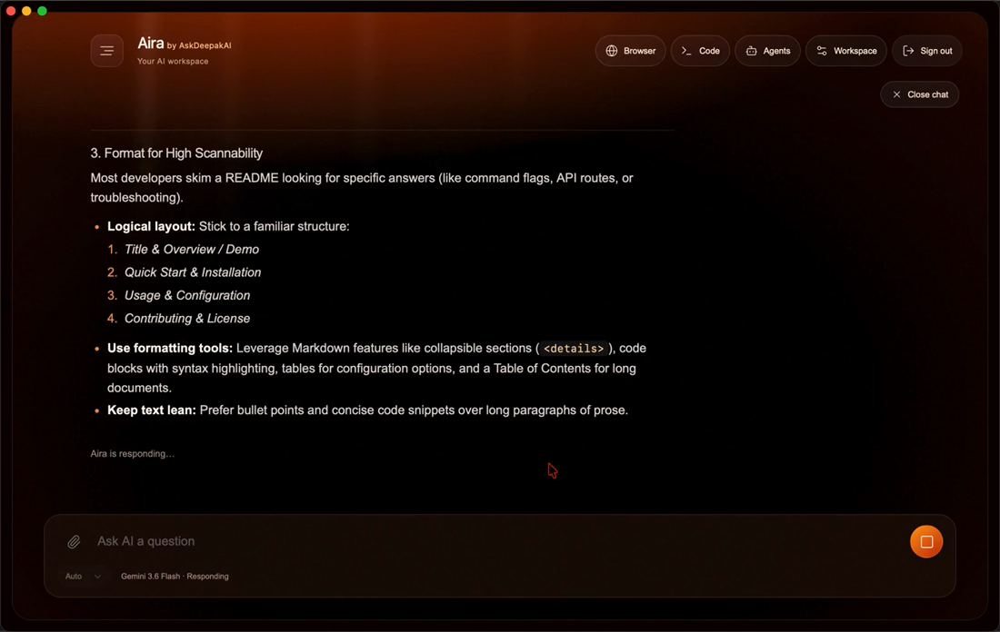
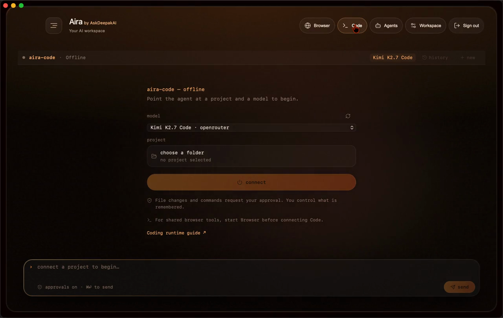
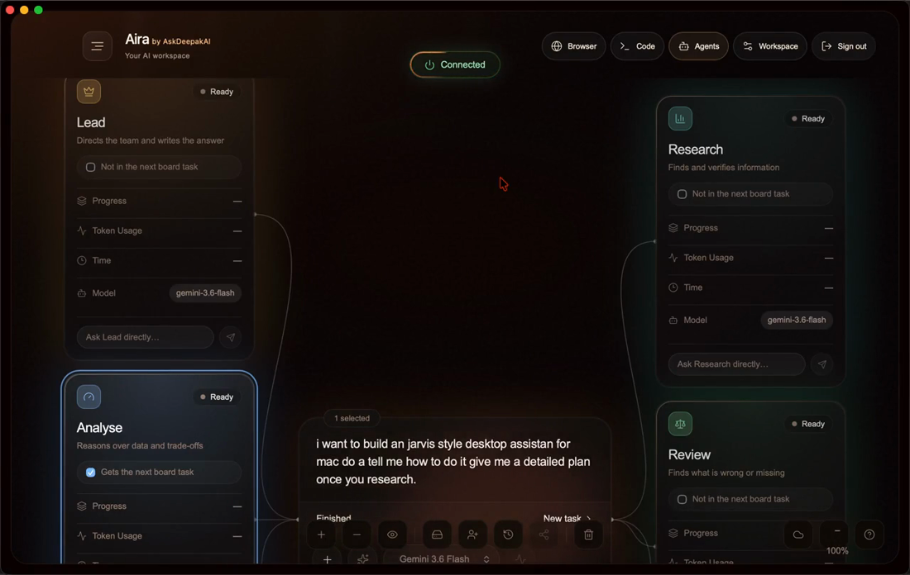
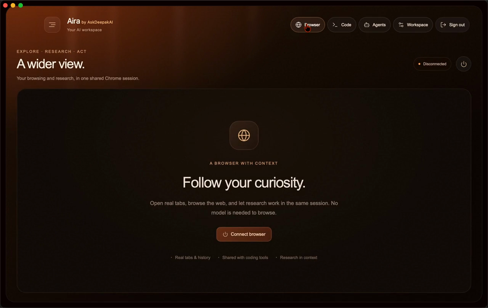

<div align="center">

# Aira

**One desktop workspace for chat, coding, autonomous agents and web research — running on your machine, across five AI providers at once.**

[](#testing)
[](#download)
[](#how-it-works)
[](#download)



*Recorded from the macOS build — nothing mocked. [Full-quality MP4](docs/media/aira-demo.mp4) · [Download for macOS](#download)*

</div>

---

## Why this exists

Most AI tools do one thing and live in a browser tab. You chat in one, code in
another, and a third reads web pages for you — and none of them know what you
did in the others.

Aira puts those jobs in a single desktop app that carries context across all of
them, and talks to five providers at once so a single vendor's outage, rate
limit or empty balance does not end your afternoon.

Three things follow from that, and they are the parts worth looking at:

- **Nothing to start.** The app launches its own gateway. There is no server to
  run first and no "connect" step.
- **A provider going down is survivable.** A failed request moves to a different
  vendor at the same tier, and the UI says which model actually answered rather
  than substituting one silently.
- **Your keys are not in the app.** A packaged `.app` can be unzipped and read,
  so provider credentials live only in the gateway.

---

## The four surfaces

### Chat & Voice



Conversation across every configured model, with a picker or automatic routing
per surface. It can read live web pages to answer questions about current
information, and page text is handed to the model as quoted material so
instructions hidden in a page cannot redirect the assistant.

Dictation is transcribed **on the machine** via whisper.cpp, so the audio never
leaves it — falling back to the browser's recogniser only when the local one is
unavailable, because a voice screen that refuses to listen is not a privacy
feature.

### Code



A coding agent with real access to your project — it reads files, writes them,
and runs commands. Every consequential action requests approval first. It can
run what it just built and show the result back, which is the half of a browser
IDE that usually goes missing.

### Agents



A fleet of six specialists — **Lead, Research, Plan, Write, Review, Analyse** —
that take tasks from a board and work them independently, each with its own
workspace, model, token budget and progress. Work can be scheduled to run
overnight with a briefing waiting in the morning. Custom agents can be added.

Asked what it could reach, a default agent listed 49 tools including arbitrary
shell execution and stored credentials. **Eighteen are blocked outright** for
every agent, and a test fails if that list is ever weakened.

### Browser



A real Chrome session an agent can drive — navigating, reading and gathering
from live sites rather than relying on a training snapshot. It shares context
with the rest of the workspace, so research done here is available to chat and
to the coding agent.

---

## Download

**[Aira 0.1.0 for macOS](releases/Aira_0.1.0_universal.dmg)** — universal binary
(Apple Silicon and Intel), 7.2 MB.

```
SHA-256  5aecc92dee78d0dcb20ae18b79f63a581c80fa54530c8c38284eb05078eeaa59
```

```sh
shasum -a 256 Aira_0.1.0_universal.dmg   # verify before opening
```

### Opening it the first time

This build is signed ad-hoc and **has not been notarised by Apple**, so
Gatekeeper will refuse it on first launch — the warning is about the absent
notarisation, not about the app. After dragging Aira to Applications:

```sh
xattr -dr com.apple.quarantine /Applications/Aira.app
```

Then open it normally. Right-click → Open works too.

### What it needs

| Requirement | Why |
|---|---|
| macOS 13 or later | Tauri 2 runtime |
| Node 22+ | The gateway runs on it |
| At least one provider key | Every surface routes through the gateway; without a key the app opens but cannot answer |

Optional, per surface: `openclaw` for the agent fleet, `opencode` for the coding
agent, whisper.cpp for on-device dictation, Ollama for local models. Each surface
reports what is missing and how to install it rather than failing silently.

---

## How it works

Every screen talks to one local service that owns the providers on their behalf.
Putting it in one place is what makes the rest possible.

```
┌─────────────────────────────────────────────────────┐
│  Desktop shell (Tauri 2, Rust)                      │
│  · starts and supervises the gateway                │
│  · owns local runtimes, kills them on exit          │
│  ┌───────────────────────────────────────────────┐  │
│  │  Workspace UI (React 19 + TypeScript)         │  │
│  │  Chat · Voice · Code · Agents · Browser       │  │
│  └───────────────────────────────────────────────┘  │
└────────────────────────┬────────────────────────────┘
                         │ HTTP + SSE
┌────────────────────────▼────────────────────────────┐
│  Gateway (Hono on Node)                             │
│  routing · fallback · memory · usage · MCP          │
└──┬───────────┬───────────┬───────────┬───────────┬──┘
   │           │           │           │           │
Anthropic   OpenAI    OpenRouter    Gemini      Ollama
                                              (local)
```

| Capability | What it does |
|---|---|
| **Provider fallback** | A failed turn moves to another vendor at the same tier. Never after output has started, never on your own mistake, never across tiers — each refusal is tested. |
| **Shared memory** | Context carries between chat, code and agents, and survives a restart. Pausable, searchable, deletable. |
| **Usage metering** | Every request records model, tokens and estimated spend, attributed to the surface that spent it — including the attempts that failed, so the bill is not understated. |
| **Second opinion** | For answers where being wrong matters, a different model from a different vendor is asked the same question and the app reports where they disagree. |
| **Interoperability** | Exposes an OpenAI-compatible API and an MCP endpoint, so other AI tools on the machine use Aira's models and memory without bespoke work. |

---

## Repository layout

| Directory | Responsibility |
|---|---|
| `apps/web` | Workspace UI — chat, voice, model picker, Code, Agents, Browser, memory |
| `apps/desktop` | Tauri shell (macOS) — runtime lifecycle, restricted native bridge |
| `apps/desktop-windows` | Tauri shell (Windows) — same web view, same bridge |
| `services/gateway` | Auth, routing, fallback, usage events, shared memory, MCP |
| `services/browser` | Dedicated Chrome session, research, local browser MCP |

Implementation and release boundaries are documented in the
[production-readiness report](docs/production-readiness-report.md).

---

## Development

**Requirements** — Node 24 LTS recommended (22+ works; the gateway runs TypeScript
directly through Node's type stripping, so there is no build step), Rust with
platform build tools (Xcode CLI or Visual Studio Build Tools), and for browser
agents Python 3.11+ with Chrome/Chromium.

```sh
# install
npm --prefix apps/web ci
npm --prefix services/gateway ci
npm --prefix apps/desktop ci

# configure — copy each .env.example to .env
#   apps/web/.env          public project settings only
#   services/gateway/.env  provider keys and the Supabase service-role key
```

> **Keys live in the gateway, never in the web environment.** The web build ships
> to a browser; anything in it is public.

```sh
# run — two terminals
npm --prefix services/gateway run dev     # :8787
npm --prefix apps/web run dev             # :5180

# or the desktop shell, which starts its own copy of both
npm --prefix apps/desktop run dev
```

The gateway's schema is applied with `npm --prefix services/gateway run migrate`,
and `migrate:check` reports whether it is in place. Without it memory still works
but does not survive a restart, and `/health` says so.

---

## Testing

```sh
npm --prefix services/gateway test        # 217
npm --prefix apps/web test                # 104
cargo test --manifest-path apps/desktop/src-tauri/Cargo.toml   # 42
python3 -m unittest discover -s services/browser -p 'test_*.py' # 9
```

**372 tests**, all passing. They are written against the failures that actually
happened — a fleet that reported one agent instead of six, a store that claimed
a database it had never spoken to, a retry that would have appended a second
answer to a half-delivered first one.

Integration checks that need real runtimes live behind
`npm --prefix services/gateway run test:integration`, and skip rather than fail
when a runtime is not installed.

---

## Status

| | |
|---|---|
| Chat, routing, fallback | Working — 5 providers, automatic failover |
| Shared memory | Working — verified across a restart |
| Coding agent | Working — real file access behind approval gates |
| Browser research | Working |
| Agent fleet | Working — requires `openclaw` |
| Voice dictation | Built — needs a one-time speech-model download |
| Cost tracking | Partial — recorded per request, not yet stored durably |
| Distribution | Not ready — ad-hoc signed, not notarised |
| Windows | Shell exists; less exercised than macOS |

---

<div align="center">

**Aira** · by [AskDeepakAI](https://github.com/thedeepakreddy)

</div>
